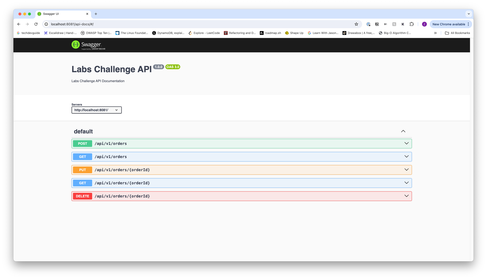
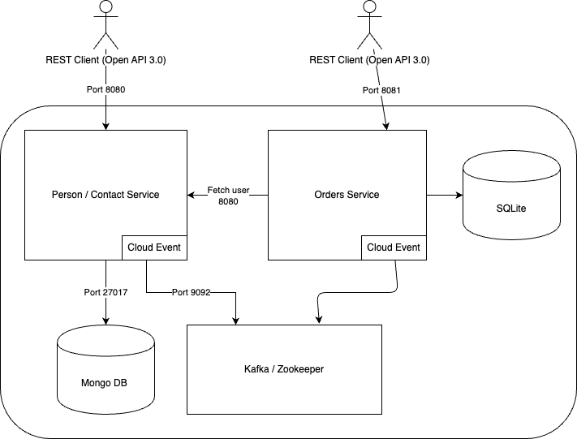

# The challege

visit: [api-docs](http://localhost:8081/api-docs)

I've setup 5 endpoits for CRUD operations:

- create order
- update order
- delete order
- find order
- find all orders



## Setup the environment

You need to copy the `.env.example` into `.env`

```bash
$ cp .env.example .env
```

The `.env.example` file contains environment variables such as topics, brokers, port, host etc. this are needed by the services to run correctly. if ran from your machine `localhost` you can use the default `.env`.

> As of now the `orders-service` can be lifted via docker composed, it already has the environment variables overrides needed.

### Run from container

When using `docker-compose.yml` to run the whole application you need to take into account the hosts are not the same as `localhost` beause of docker networking, for that we have environment variables (override) `.env` ones.

```yaml
environment:
  - CONTACTS_SERVICE_HOST=http://contact-service:8080
  - KAFKA_BOOTSTRAP_SERVER=kafka:9092
```

This makes sure `orders-service` is able to reach to `contact-service` and comunicate with kafka broker.

```bash
$ docker-compose up -d
```

### Run it locally:

```bash
$ npm run dev
```

The command above uses `tsx` to run Typescript (`no compilation needed`).

### Compile

If any changes are introduced to the code base we need to compile the project again if we want the changes to be available when we run `docker-compose`.

I've added npm script to build

```
$ npm run build
```

## Project structure:

The project structure is very simple, the main components for the service are:

- **The API**: the collection of rest endpoints for CRUD operations
- **Kafka**: Holds the producer, consumer and event handlers

The rest of the structure follows the basic structure for Express.

```
└── 📁src
    └── 📁api
        └── 📁health
        └── 📁v1
            └── 📁controllers
            └── 📁routes
    └── 📁kafka
        └── 📁consumers
        └── 📁event-handlers
        └── 📁producers
    └── 📁libs
    └── 📁middleware
    └── 📁models
    └── 📁services
    └── 📁types
        └── global.d.ts
    └── 📁utils
        └── axiosRetry.ts
        └── cloudEvents.ts
        └── envConfig.ts
        └── kafkaConfig.ts
        └── swagger.ts
    |
    └── index.ts
    └── server.ts
```

- **libs**: Containts the HTTP client used to comunicate with `contact-service`
- **middleware** Only contains a errorHandler middleware to process HTTP response errors
- **models**: Includes

## Data modeling

I've used a relational database with Sequelize ORM to make the challenge more diverse, `contact-service` uses NoSQL and `orders-service` uses SQL. To keep it simple I've used sqlite as it needs very little setup.

Since I'm using SQL I needed to consider the relation between `Contacts` and `Orders`, as I see it is a `n:m` relationship where one `user` can have many `orders`.

### User model

```
pk: id STRING
------
firstName TEXT
lastName TEXT
houseNumber TEXT
streetAddress TEXT
city TEXT
country TEXT
zip TEXT
synced BOOLEAN
extensionFields TEXT
```

### Order Model

```
pk: id STRING
------
description TEXT
------
fk: userId STRING
```

Since `user` is a foreing key of `order` I can query the user data on a very simple query with Sequelize:

```typescript
const { Order, User } = models;
const order = await Order.findByPk(id, {
  attributes: ['id', 'description'],
  include: [
    {
      model: User,
      attribures: [
        'firstName',
        'lastName',
        'houseNumber',
        'streetAddress',
        'city',
        'zip',
        'country',
        'synced',
        'extensionFields',
      ],
    },
  ],
});
```

### Why `extensionFields` data type is text ?

To simplify things I've decided to store it as `TEXT`, I strigify the `extensionFields` object when inserting/updating a new user record and parse it when fetching the data.

Sequelize provides Setter/Getter functions to allow these transformations.

```typescript
extensionFields: {
  type: DataTypes.TEXT,
  get: function () {
    const value = this.getDataValue('extensionFields');
    const parsedValue = JSON.parse(value);
    return parsedValue;
  },
  set: function (value) {
    const parsedValue = JSON.stringify(value);
    this.setDataValue('extensionFields', parsedValue);
  },
},
```

## Architecture



### Retry Mechanisim: Axios

Since we have a dependcy on `contact-service` we need to take into account any issues that might come of it, meaning the service could be down or unable to respond. To account for those cases I've implemented a retry mechanisim with Axios.

The retry mechanisim will try to fetch from the service at least three times before throwing an exeption.

```typescript
import axios, { AxiosInstance } from 'axios';

const instance: AxiosInstance = axios.create({
  timeout: 5000,
});

const retryCount = 3;

instance.interceptors.response.use(undefined, async function axiosRetryInterceptor(error) {
  const config = error.config;

  if (!config || !config.retryCount) return Promise.reject(error);

  config.retryCount -= 1;
  const delay = Math.pow(2, retryCount - config.retryCount) * 1000;

  await new Promise((res) => setTimeout(res, delay));

  return instance(config);
});

export default instance;
```

> Under the hood this middleware is using Axios interceptor to analyze the request

### Event handlers:

In the project you will find 6 event handlers, three for the user topics and three for order topics.

#### contacts:

- `handle-person-changed`: Is the one responsable for triggering the user update workflow on `orders-service`. It's a simple handler that hides the implementation, it only parses the event and forwards it to `userService.ts` where the actual update happens.

- `handler-person-deleted`: Only logs the event, if a user doesn't exist anymore on contacts we should deleted it in `orders-service` and all ordes will be incomplete.

- `handler-person-deleted`: Only logs the event, we don't need to create a new user on `orders-service` on every event.

#### orders:

All user event handlers perform the same function, differing only in the topic they write to. Why separate them? Each handler is specific to a topic so that changes can be made individually without affecting the others.

```typescript
import { orderUpdatedEvent, serializeCloudEvent } from '../../utils/cloudEvents';
import config from '../../utils/kafkaConfig';
import { sendMessage } from '../producers';

const TOPIC = config.topicOrderChanged;

const handleOrderUpdatedEvents = async (event: any) => {
  try {
    const { orderid } = event;
    const cloudEvent = orderUpdatedEvent({ orderid });
    const message = serializeCloudEvent(cloudEvent);

    await sendMessage(TOPIC, message);
  } catch (error) {
    console.error('Error handling order updated event:', error);
  }
};

export { handleOrderUpdatedEvents };
```

## Fails

I failed to make `CloudEvents` properly decode the incoming events from Kafka so as of now I'm "manually" decoding the event, not very pretty I know.

```typescript
function readCloudEvent(event: any) {
  console.log(event);
  return event.data;
}
```
